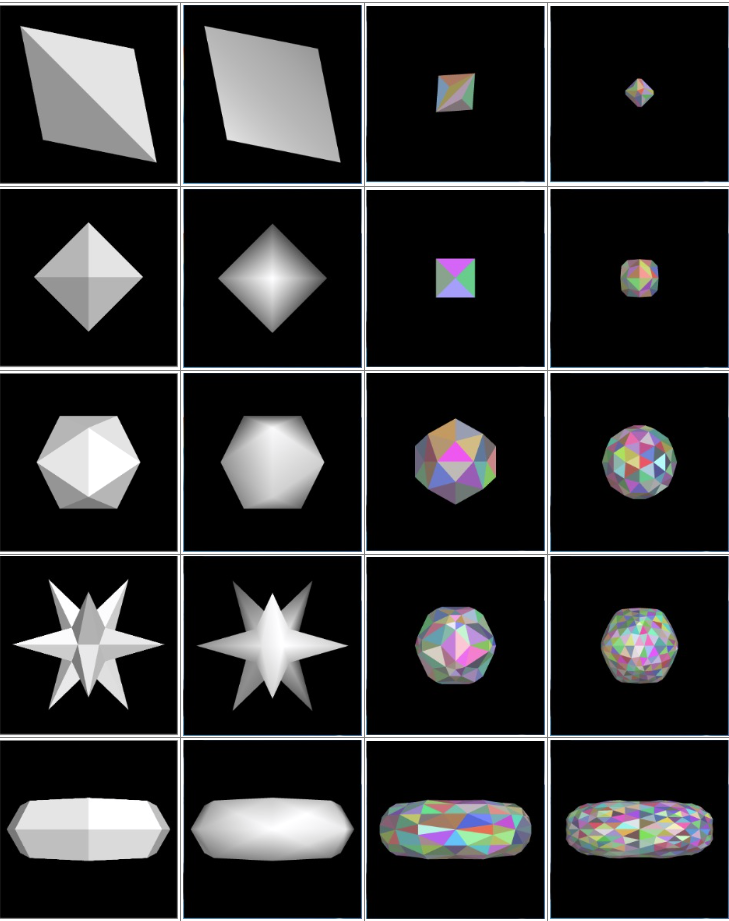

# Dual Meshes
Reads in polyhedral models and creates a triangulated dual. Duals can be performed more than once.

Contains ability to toggle between flat shading (per-polygon normals) & smooth shading (per-vertex normals).

## Results

## Implementation Details
Uses "corners" representation of the polygon mesh (Dr. Jarek Rossignac) allowing one to easily move from one face to adjacent faces.